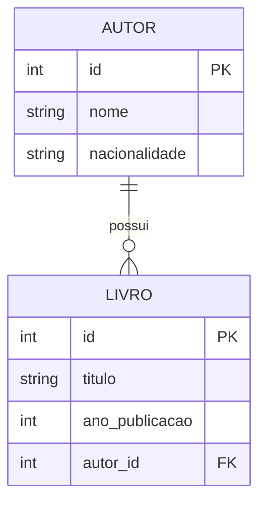

# Nycolas Guilherme Nunes da Silva

# Sistema de Biblioteca

Projeto desenvolvido em Django para gerenciamento de autores e livros. Ele reúne uma interface web com CRUD completo, uma API REST protegida por JWT, documentação Swagger e integração com a API pública Open Library.

## Funcionalidades

- CRUD público de autores e livros.
- Relacionamento entre as entidades: um autor pode possuir vários livros.
- Painel administrativo do Django.
- Busca de livros na Open Library, com tratamento de timeout, erros HTTP, conexão e dados inválidos.
- Importação de livros encontrados na Open Library para o catálogo local.
- API REST para autores e livros.
- Autenticação JWT para os endpoints da API.
- Documentação interativa da API com Swagger.
- Filtros, ordenação e paginação na API.
- Testes automatizados e integração contínua no GitHub Actions.

## Requisitos atendidos

### Requisitos obrigatórios

- Projeto Django com interface web em templates HTML.
- CRUD completo de autores e livros.
- Duas entidades relacionadas por chave estrangeira: `Autor` e `Livro`.
- Consumo da API externa gratuita Open Library.
- Tratamento de erros de timeout, conexão, status HTTP e dados inválidos.
- Arquivos `.gitignore`, `requirements.txt` e `README.md` configurados.
- Repositório com o nome solicitado: `wsBackendFabricaDeSoftware26.2`.

### Diferenciais implementados

- Banco PostgreSQL externo no ambiente publicado.
- Commits semânticos e integração contínua com GitHub Actions.
- Organização em modelos, views, formulários, serializers, rotas, templates e arquivos estáticos.
- Documentação de instalação, uso, API e deploy.
- Interface funcional com HTML, CSS responsivo e templates Jinja/Django.
- API REST protegida com autenticação JWT.
- Documentação interativa da API com Swagger/OpenAPI.
- Filtros, ordenação e paginação nos endpoints da API.

## Tecnologias

- Python 3.12 ou superior
- Django 6.1
- Django REST Framework
- Simple JWT
- drf-spectacular (Swagger/OpenAPI)
- SQLite para desenvolvimento local
- PostgreSQL externo gerenciado pelo Render para o ambiente publicado
- Requests

## Banco de dados

O projeto utiliza dois bancos conforme o ambiente:

| Ambiente | Banco de dados | Configuração |
| --- | --- | --- |
| Desenvolvimento local | SQLite | Arquivo local `db.sqlite3`. |
| Produção no Render | PostgreSQL externo | Variável de ambiente `DATABASE_URL` conectada ao banco `biblioteca-db`. |

Essa configuração permite desenvolver sem instalar um banco adicional no computador e manter dados persistentes no ambiente online.

## Modelo de dados

O relacionamento principal do sistema é de um para muitos: um autor pode possuir vários livros, mas cada livro pertence a apenas um autor.



O campo `autor_id` é uma chave estrangeira que relaciona cada livro ao seu autor.

## Pré-requisitos

- Git instalado.
- Python 3.12 ou superior instalado e disponível no terminal.

## Como executar localmente

### 1. Clone o repositório

```bash
git clone https://github.com/v3sp1n3/wsBackendFabricaDeSoftware26.2.git
cd wsBackendFabricaDeSoftware26.2
```

### 2. Crie e ative o ambiente virtual

Windows PowerShell:

```powershell
python -m venv venv
.\venv\Scripts\Activate
```

Linux/macOS:

```bash
python3 -m venv venv
source venv/bin/activate
```

### 3. Instale as dependências

```bash
python -m pip install --upgrade pip
pip install -r requirements.txt
```

### 4. Crie as tabelas do banco de dados

```bash
python manage.py migrate
```

### 5. Crie um usuário administrador

Este passo é recomendado para acessar o painel administrativo e gerar tokens JWT.

```bash
python manage.py createsuperuser
```

Informe nome de usuário, e-mail (opcional) e senha quando solicitado.

### 6. Inicie o servidor

```bash
python manage.py runserver
```

Abra [http://127.0.0.1:8000/](http://127.0.0.1:8000/) no navegador.

## Rotas da interface web

| Rota | Descrição |
| --- | --- |
| `/` | Lista e gerenciamento de livros. |
| `/livros/novo/` | Cadastro de livro. |
| `/autores/` | Lista e gerenciamento de autores. |
| `/autores/novo/` | Cadastro de autor. |
| `/buscar/` | Busca e importação de livros da Open Library. |
| `/admin/` | Painel administrativo do Django. |

## API REST

| Rota | Descrição |
| --- | --- |
| `/api/` | Raiz navegável da API. |
| `/api/autores/` | CRUD REST de autores. |
| `/api/livros/` | CRUD REST de livros. |
| `/api/token/` | Geração de token JWT. |
| `/api/token/refresh/` | Renovação do token JWT. |
| `/api/docs/` | Documentação Swagger. |
| `/api/schema/` | Esquema OpenAPI. |

### Autenticação JWT

Os endpoints de autores e livros exigem autenticação. Envie uma requisição `POST` para `/api/token/` usando o usuário criado pelo `createsuperuser`:

```json
{
  "username": "seu_usuario",
  "password": "sua_senha"
}
```

A resposta terá os tokens `access` e `refresh`. Para acessar a API, envie o token de acesso no cabeçalho:

```text
Authorization: Bearer SEU_TOKEN_DE_ACESSO
```

No Swagger, abra `/api/docs/`, clique em **Authorize** e informe:

```text
Bearer SEU_TOKEN_DE_ACESSO
```

### Filtros, ordenação e paginação

Exemplos de uso:

```text
/api/livros/?search=casmurro
/api/livros/?search=machado
/api/livros/?ordering=-ano_publicacao
/api/livros/?page=2
/api/autores/?search=brasileira
```

## Testes

Com o ambiente virtual ativo, execute:

```bash
python manage.py check
python manage.py test
```

Os testes usam um banco temporário e não alteram o banco de dados local. O GitHub Actions também executa essas verificações automaticamente a cada envio para a branch `main`.

## Deploy no Render

O projeto está preparado para executar localmente com SQLite e, no Render, usar PostgreSQL por meio da variável `DATABASE_URL`.

1. Envie as alterações para o GitHub.
2. No painel do Render, crie um banco **PostgreSQL** e copie a **Internal Database URL**.
3. Crie um **Web Service**, conecte este repositório e selecione o ambiente **Python 3**.
4. Configure os comandos:

   ```text
   Build Command: bash build.sh
   Start Command: gunicorn config.wsgi:application
   ```

5. Adicione as variáveis de ambiente:

   | Chave | Valor |
   | --- | --- |
   | `DATABASE_URL` | Internal Database URL do banco criado. |
   | `SECRET_KEY` | Use a opção Generate do Render. |
   | `DEBUG` | `False` |
   | `WEB_CONCURRENCY` | `2` |

O arquivo `build.sh` instala as dependências, coleta os arquivos estáticos e aplica as migrações a cada deploy. Ao final, crie o administrador pelo Shell do Render:

```bash
python manage.py createsuperuser
```

O serviço fornecerá uma URL pública no formato `https://nome-do-servico.onrender.com`.

Como este: https://wsbackendfabricadesoftware26-2.onrender.com/

## Estrutura principal

```text
biblioteca/
├── api_urls.py          # Rotas da API REST
├── api_views.py         # ViewSets da API
├── forms.py             # Formulário de importação externa
├── models.py            # Autor e Livro
├── serializers.py       # Serializers da API
├── static/              # Arquivos CSS
├── templates/           # Páginas HTML
├── tests.py             # Testes automatizados
├── urls.py              # Rotas da interface web
└── views.py             # Views da interface web
```
